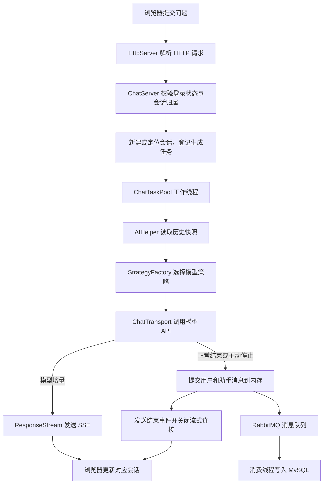

#  C++ AI应用开发项目 - AI应用服务平台 第二版

本文前半部分说明**当前仓库的项目背景、实现流程和运行步骤**；文末保留原项目介绍与资料。功能状态和启动方式以当前代码及下文为准。

## 快速启动（Ubuntu 24.04）

```bash
git clone https://github.com/wyo-yoo/CppAIService.git
cd CppAIService
bash scripts/install-deps.sh
python3 scripts/setup_database.py
# 在生成的 .env 中填写要使用的模型 API Key。
bash scripts/build.sh
bash scripts/run.sh 8080
```

`install-deps.sh` 安装系统库、MySQL/RabbitMQ，并从固定版本源码构建 Muduo 与 SimpleAmqpClient。安装前缀默认是项目同级的 `.cppaiservice-deps/install`，可通过 `CPP_AI_DEPS_DIR` 修改依赖目录；构建脚本使用相同变量。

`setup_database.py` 用 `sudo mysql` 创建本机应用账户和基础表，生成随机数据库密码并写入权限为 `600` 的 `.env`。sudo 提示要求的是 Ubuntu 登录密码。已有账户、已有表和已有数据会保留；已有 `.env` 时使用其中的数据库配置，不重置已有账户密码。

`.env`、编译目录、编译产物和本机编辑器配置均不提交到 GitHub。已有数据库时可复制 `.env.example` 为 `.env`，填写连接信息后按下文核对表结构。

只启动网页和登录功能无需模型密钥；真实聊天、RAG 和语音调用需要相应服务的有效凭据。

## 目录

- [项目背景](#项目背景)
- [当前功能与实现范围](#当前功能与实现范围)
- [项目结构](#项目结构)
- [项目运行流程](#项目运行流程)
- [环境准备与启动步骤](#环境准备与启动步骤)
- [页面使用步骤](#页面使用步骤)
- [代码阅读与二次开发步骤](#代码阅读与二次开发步骤)
- [常见问题](#常见问题)

## 项目背景

CppAIService 是一个基于 C++17 的 AI 应用服务项目，在基于 Muduo 的 HTTP 服务框架上实现用户登录、多模型对话、会话管理和语音合成等能力。浏览器提供交互界面，C++ 服务负责请求处理、上下文管理、模型调用和数据存储。

把大模型接入应用后，还需要处理一些具体问题：不同厂商的请求格式不同，多轮对话需要保留上下文，多用户之间需要隔离数据，模型生成较慢时页面需要及时反馈，聊天记录还需要在服务重启后恢复。本项目围绕这些问题，将 HTTP 层、聊天业务层、模型策略层和存储层组织起来，便于分别理解和扩展。

近期的功能升级主要改善聊天体验：模型返回一段文字，页面就显示一段；用户可以停止生成并保留已有内容；多段对话可以独立命名、切换、搜索和删除。项目也适合用于学习 C++ 网络编程、线程池、策略模式、第三方 API 对接和异步消息入库。

## 当前功能与实现范围

| 功能 | 当前实现 |
| --- | --- |
| 用户管理 | 注册、登录、退出，使用内存 Session 和 Cookie 维护登录状态 |
| 多模型对话 | `AIStrategy` + `StrategyFactory` 适配 DeepSeek、阿里百炼、豆包、百炼 RAG 和工具助手 |
| 流式输出 | 通过 SSE 增量展示模型回复；后台工作线程执行模型请求 |
| 停止生成 | 按请求 ID 取消生成，保留已生成文字；浏览器断开连接也会触发取消 |
| 多会话管理 | 按用户和会话 ID 隔离上下文，支持自动命名、重命名、删除、搜索和 Markdown 导出 |
| 历史记录 | 内存中维护对话，RabbitMQ 异步写入 MySQL；启动时恢复已入库的记录 |
| RAG | 调用配置了知识库的百炼应用；本仓库没有实现本地文档分块、向量化或 Faiss/Milvus 检索链路 |
| 工具助手 | 根据提示词约定解析工具调用，执行天气／时间工具，再由模型组织回答；属于轻量工具调用实现，尚未实现完整 MCP 协议客户端／服务端 |
| 语音 | 聊天页可调用百度 TTS 朗读；代码中包含 ASR 封装，当前页面未提供语音输入入口 |

本地 LLaMA/llama.cpp 接入、完整 MCP 协议、自建向量检索以及 Docker Compose 一键部署仍需另行实现或补充。当前仓库的验证方式是 CMake 构建及独立测试脚本。

流式接口、取消行为、并发限制和验证范围详见 [聊天功能升级说明](docs/CHAT_FEATURES.md)。

## 项目结构

```text
CppAIService/
├── CMakeLists.txt                 # C++17 构建入口及可选模块
├── HttpServer/
│   ├── include/                  # HTTP、路由、中间件、Session、数据库接口
│   └── src/                      # 对应实现，包含 SSE 响应输出
├── AIApps/ChatServer/
│   ├── include/AIUtil/           # 模型策略、AIHelper、流式传输、任务池等
│   ├── include/handlers/         # 登录、聊天、历史、语音等处理器
│   ├── src/main.cpp              # 程序入口、消息队列消费与入库
│   ├── src/ChatServer.cpp        # 服务初始化、路由注册和历史恢复
│   ├── src/ChatFeatures.cpp      # 流式聊天、取消、会话重命名与删除
│   └── resource/                 # HTML 页面、工具列表及提示词配置
├── docs/CHAT_FEATURES.md          # 新聊天功能的接口与测试说明
└── tests/                        # 核心、HTTP、浏览器和 MySQL 集成测试
```

## 项目运行流程

### 1. 服务启动流程

1. `main.cpp` 读取监听端口，创建 `ChatServer`。
2. `ChatServer::initialize()` 初始化 MySQL 连接池、登录 Session、中间件和业务路由，并创建会话元数据表 `chat_sessions`。
3. `initChatMessage()` 从 MySQL 加载未删除会话的名称和消息，恢复到内存中的用户／会话映射。
4. 启动 RabbitMQ 消费线程，准备接收聊天消息入库任务。
5. 启动 HTTP 服务，浏览器可以访问入口页面并登录。

### 2. 一次聊天请求的流程



浏览器通过 `POST /chat/stream` 发送问题、模型类型、请求 ID 和可选的会话 ID。新会话会先返回 `meta` 事件，随后通过 `delta` 事件发送增量文字，最终返回 `done` 或 `error`。AI 生成在工作线程中执行，历史读取无需等待整段回答完成。

模型策略的处理方式如下：普通对话直接调用对应厂商接口；RAG 调用百炼应用接口；工具助手先请求模型判断是否需要工具，需要时执行工具并再次请求模型生成最终回答。工具判断阶段使用普通响应，第二次回答支持流式输出；不需要工具时直接展示第一次回答。

### 3. 停止生成与会话保存流程

1. 用户点击“停止生成”，浏览器携带 `requestId` 请求 `POST /chat/cancel`。
2. 后端检查该任务属于当前登录用户，设置取消标记。
3. 模型传输循环检查取消状态，结束上游请求，保存已收到的部分回答，并返回 `stopped: true`。
4. 页面保留已生成文字，恢复发送按钮，用户可以在同一会话中继续提问。

`AIHelper` 对成功或主动停止的轮次保存一对用户／助手消息；模型请求失败时不提交该轮次到服务端历史。消息发布到队列后由消费线程异步入库，因此页面完成生成不等于 MySQL 已完成写入。

会话名称和删除状态直接写入 `chat_sessions`。删除采用逻辑标记：列表和历史接口不再返回该会话，新增格式的迟到队列消息会跳过它；原始消息行暂时保留。生成中的会话需要先停止或等待结束，才能删除。

## 环境准备与启动步骤

以下命令按 Ubuntu 和当前远程项目目录编写。在其他机器上运行时，替换项目目录和依赖安装目录即可。

### 第一步：准备编译依赖和基础服务

项目使用 C++17，已在 Ubuntu 24.04、CMake 3.28 环境验证聊天功能构建。

```bash
sudo apt-get update
sudo apt-get install -y build-essential cmake git python3 \
  libssl-dev libcurl4-openssl-dev nlohmann-json3-dev \
  libboost-dev libboost-chrono-dev libboost-system-dev \
  libmysqlcppconn-dev default-libmysqlclient-dev librabbitmq-dev \
  mysql-server rabbitmq-server
```

另外需要安装 Muduo 和 SimpleAmqpClient 的头文件与库。当前虚拟机中它们已安装在 `/home/wy/project/.cppaiservice-deps/install`，后面的 `CMAKE_PREFIX_PATH` 指向该目录；全新机器需先安装这两个库，再填写实际安装前缀。

```bash
sudo systemctl start mysql
sudo systemctl start rabbitmq-server
```

### 第二步：准备数据库并核对连接配置

在 MySQL 中执行以下 SQL，创建与当前代码兼容的基础表。已有数据库时先核对字段，无需重新创建或清空现有数据。

```sql
CREATE DATABASE IF NOT EXISTS ChatHttpServer CHARACTER SET utf8mb4;
USE ChatHttpServer;

CREATE TABLE IF NOT EXISTS users (
    id INT NOT NULL AUTO_INCREMENT PRIMARY KEY,
    username VARCHAR(255) NOT NULL UNIQUE,
    password VARCHAR(255) NOT NULL
) ENGINE=InnoDB DEFAULT CHARSET=utf8mb4;

CREATE TABLE IF NOT EXISTS chat_message (
    id INT NOT NULL COMMENT '用户 ID，对应 users.id',
    username VARCHAR(255) NOT NULL,
    session_id VARCHAR(64) NOT NULL,
    is_user TINYINT NOT NULL COMMENT '1 表示用户，0 表示助手',
    content MEDIUMTEXT NOT NULL,
    ts BIGINT NOT NULL COMMENT '毫秒时间戳',
    KEY idx_chat_history (id, session_id, ts)
) ENGINE=InnoDB DEFAULT CHARSET=utf8mb4;
```

`chat_message.id` 是用户 ID，一位用户会有多条消息，不能把它单独设为消息表主键。第三张表 `chat_sessions` 由程序启动时自动创建，保存 `user_id`、`session_id`、`title` 和 `deleted`。

MySQL 连接信息通过 `CHAT_MYSQL_URL`、`CHAT_MYSQL_USER`、`CHAT_MYSQL_PASSWORD` 和 `CHAT_MYSQL_DATABASE` 环境变量配置。`scripts/run.sh` 自动加载本机 `.env`，修改连接参数后重启程序即可，无需重新编译。Ubuntu 的系统管理账户不一定能直接通过 TCP 密码登录；建议运行 `python3 scripts/setup_database.py` 创建专用应用账户和基础表。应用账户需要读写以上数据表及创建 `chat_sessions` 的权限。

RabbitMQ 当前默认连接本机 `localhost:5672`，使用 `guest` 账户和 `/` vhost，队列名为 `sql_queue`。更换连接配置时应同时核对 `MQManager.cpp` 的发布端、消费端，以及 `main.cpp` 的主机设置。

### 第三步：配置需要使用的模型

在**启动程序的同一个终端环境**中设置变量，按实际使用的功能填写：

| 功能 | 配置项 |
| --- | --- |
| DeepSeek（默认） | `DEEPSEEK_API_KEY`；可选 `DEEPSEEK_MODEL` |
| 阿里百炼／工具助手 | `DASHSCOPE_API_KEY` |
| 豆包 | `DOUBAO_API_KEY` |
| 百炼 RAG | `DASHSCOPE_API_KEY` 和 `Knowledge_Base_ID` |
| 百度语音合成 | `BAIDU_CLIENT_ID` 和 `BAIDU_CLIENT_SECRET` |

聊天页默认选择 DeepSeek（`modelType=5`），接入官方 `/chat/completions` 接口并支持流式输出、停止生成和多轮历史。将密钥填入本机 `.env` 的 `DEEPSEEK_API_KEY` 后，使用 `bash scripts/run.sh 8080` 启动。模型名默认是 `deepseek-flash`，也可通过 `DEEPSEEK_MODEL` 切换为账号可用的模型。密钥不能填写到源码或 `.env.example` 中。

例如，只体验百炼聊天时，可以通过交互输入设置密钥：

```bash
read -r -s -p '请输入百炼 API Key: ' DASHSCOPE_API_KEY
echo
export DASHSCOPE_API_KEY
```

`Knowledge_Base_ID` 是代码中的历史变量名，实际被拼接到 `/api/v1/apps/{ID}/completion`，应填写对应的**百炼应用 ID**，并在该应用中配置知识库。模型名称和服务地址在 `AIStrategy.cpp` 中设置，需要使用账户已开通的模型。

工具助手还会读取 `AIApps/ChatServer/resource/config.json` 中的 `prompt_template` 和 `tools`，工具名需要与 `AIToolRegistry` 注册项一致。

### 第四步：编译聊天功能

```bash
cd /home/wy/project/CppAIService
cmake -S . -B build-chat \
  -DCMAKE_BUILD_TYPE=Debug \
  -DCMAKE_PREFIX_PATH=/home/wy/project/.cppaiservice-deps/install \
  -DCHAT_BUILD_TESTS=ON
cmake --build build-chat -j2
```

该构建包含当前保留的聊天、会话管理、工具助手和语音功能。

### 第五步：运行测试

```bash
cd /home/wy/project/CppAIService
ctest --test-dir build-chat --output-on-failure
```

默认三组测试覆盖核心对话逻辑、模型传输和实际 HTTP 流式响应，使用本地模拟模型，无需付费模型密钥。需要检查真实 MySQL 的会话恢复行为时，可运行隔离的集成测试：

```bash
python3 tests/test_sessions.py build-chat/chat_session_fixture /usr/sbin/mysqld
```

该脚本创建并清理临时数据库，使用生产聊天路由、本地模拟模型和同步入库替身，不操作业务数据库，也不验证真实 RabbitMQ 交付。浏览器测试步骤见 [聊天功能升级说明](docs/CHAT_FEATURES.md#验证及范围)。

### 第六步：启动服务并访问页面

```bash
cd /home/wy/project/CppAIService
bash scripts/run.sh 8080
```

`scripts/run.sh` 会切换到项目下一级的构建目录，以匹配现有 `../AIApps/ChatServer/resource/` 相对资源路径。启动前应完成数据库、RabbitMQ 和所用模型的配置。

在虚拟机内访问 `http://127.0.0.1:8080/`；在当前宿主机浏览器中访问 `http://192.168.135.129:8080/`。如果虚拟机 IP 或端口改变，使用实际地址。

## 页面使用步骤

1. 打开入口页，注册账户并登录，进入应用菜单。
2. 进入 AI 聊天，选择已经配置好的模型。
3. 直接发送第一条问题，系统自动创建会话并生成标题，也可以先点击“新建会话”。
4. 观察回答逐段出现；需要结束当前回答时点击“停止生成”，随后可以继续追问。
5. 使用左侧列表切换会话。生成期间切换不会改变回答所属的会话，可通过“返回生成中的会话”切回。
6. 使用重命名、名称搜索和导出管理对话；不再需要的会话可以删除。手机上通过顶部菜单打开会话列表。

同一用户同时只允许一个流式生成任务。登录状态存储在内存中，服务重启后需要重新登录；已入库的聊天历史和会话名称会从 MySQL 恢复。

## 代码阅读与二次开发步骤

| 顺序 | 阅读入口 | 重点理解 |
| --- | --- | --- |
| 1 | `main.cpp` → `ChatServer.cpp` | 启动顺序、依赖初始化、路由注册、历史恢复 |
| 2 | `HttpContext.cpp` → `HttpServer.cpp` | HTTP 请求解析、路由分发、普通响应与流式响应 |
| 3 | `ChatFeatures.cpp` → `AIHelper.cpp` | 登录校验、会话定位、任务取消、历史快照和消息提交 |
| 4 | `AIFactory.cpp` → `AIStrategy.cpp` → `ChatStream.cpp` | 策略选择、厂商请求格式、SSE 解析与超时取消 |
| 5 | `MQManager.cpp` → `main.cpp` 中的 `executeMysql` | 发布消息、消费确认、数据库写入及删除过滤 |
| 6 | `resource/AI.html` → `tests/` | 页面状态、会话切换、增量渲染与回归验证 |

新增模型时实现 `AIStrategy` 并在工厂注册，同时更新流式接口的模型校验和页面选项；新增工具时同步修改 `AIToolRegistry` 与 `config.json`；修改聊天行为后，先运行对应的传输、会话或浏览器测试，再使用真实模型验证。

## 常见问题

| 现象 | 检查位置 |
| --- | --- |
| CMake 找不到 Muduo 或 SimpleAmqpClient | 检查安装是否包含头文件和库，以及 `CMAKE_PREFIX_PATH` 是否正确 |
| 启动时报数据库连接或缺表错误 | 核对 MySQL 服务、TCP 账户、连接配置、库名和基础表 |
| 页面能打开，但生成时报错 | 检查启动进程中的模型环境变量、模型权限和上游网络；同时核对 RabbitMQ 发布是否正常 |
| 找不到 HTML 或工具配置文件 | 确认程序从 `build-chat` 等项目下一级目录启动 |
| 回答一次性出现，代理后不再流式 | 检查反向代理是否启用了响应缓冲，并设置足够长的读取超时 |
| 重启后缺少最近的消息 | 检查 RabbitMQ 消费日志及 MySQL 写入，页面完成生成与异步入库不是同一时刻 |

## 原项目介绍与资料

以下保留原项目的介绍、图片和资料链接，其中的扩展规划与当前仓库实现范围可能不同；当前可用功能见本文前半部分。


> **本项目目前只在[知识星球](https://programmercarl.com/other/kstar.html)答疑并维护**。

在9月份我们发布了[C++AI应用服务平台（第一版）](https://programmercarl.com/other/project_http_ai.html) 这个项目。

当然刚发布，第二版就已经在路上了。

**现在AI应用服务平台第二版（C++），正式发布**！

这次，在自研 [C++ HTTP 框架](https://programmercarl.com/other/project_http.html)上，**把多模型对话、RAG、轻量级 MCP、ASR/TTS、消息队列异步化、会话多租户化 全部落地，并用策略模式 + 注册式工厂把“接什么模型、怎么调用、能否用工具”彻底解耦**。

第二版不是简单加功能，而是把AI 应用工程化做深做透。

相对于[第一版](https://programmercarl.com/other/project_http_ai.html)，第二版我们优化了这些内容。


## 第二版核心技术点：

- **多模型适配（Strategy + Factory）**：统一抽象 `AIStrategy`，一键切换 **阿里百炼 / 百炼-RAG / 豆包 /（预留）本地 LLaMA/llama.cpp、GGUF**。
- **轻量级 MCP 思想落地**：通过 **配置化工具注册（`AIToolRegistry`）+ Prompt 协议化** 实现“模型判断→工具调用→二次回答”的 **两段式推理**，对齐 **Model Context Protocol** 的核心理念。
- **RAG 检索增强**：解析→分块→嵌入→ANN 检索（Faiss/Milvus 预留）→可选重排→**带引用回答**，支持 **知识库 ID** 配置化接入。
- **多会话管理**：从 **单用户单会话** 升级为 **单用户多会话**，`unordered_map<userId, map<sessionId, AIHelper>>` 精准隔离上下文。
- **语音链路（ASR/TTS）**：集成 **百度 TTS**（任务创建→轮询→回传 URL），ASR 接口封装预留；支持 **参数化语速/音色**。
- **异步化与可靠性**：**RabbitMQ** 承载持久化写库，前台 **同步写内存、异步入库**，避免主线程阻塞；幂等/重试机制可扩展。
- **全链路可维护**：`AIHelper` 重构，**对话/模型切换/消息入库** 一步到位；**配置驱动（`config.json`）** 管理工具清单与 Prompt 模板。
- **容器化交付**：**独立 v1/v2 Docker 镜像**，MySQL + RabbitMQ 一键拉起；环境一致、上手即跑。

## 本项目视频演示


## 为什么市面上没有C++ AI应用项目？

大家会发现市面上，很少有 C++ AI应用开发的项目教程。

因为C++ 没有成熟的 AI 框架封装（如 LangChain、FastAPI 那种现成的 SDK）。

相对于Java ，**Spring AI 在 Spring Boot 基础上已经封装的 各种AI 应用层框架**。

可以一行配置 即可接入 ChatGPT、Claude、通义、文心等；

还支持 Prompt 模板、工具调用（Function Calling）、RAG、向量检索；内置安全、配置、日志、监控体系；等等


还能无缝集成 Spring Cloud、Spring Security、Redis、MySQL。

换句话说： Spring AI 把“大模型调用”当作一种新的 Bean，让 Java 工程师能像调接口一样玩 AI。

大家看过的 不少 包装了各种高大上的名字的java项目，其实就是在 Spring AI 里的一个配置而已。

而C++ 没有这种生态，以至于，大家在网上 基本找不到 C++ ai应用开发的教程。

因为啥都要自己写，一步一步自己造轮子，难度就上了一个台阶。


## 架构图


架构图展示了 自研 [C++ HTTP 服务框架](https://programmercarl.com/other/project_http.html) 如何将 AI 模型调用、消息队列、数据库存储与多厂商模型 API 进行解耦，实现了高性能、可扩展、可私有化部署的 AI 应用平台。

整个系统从上到下可分为四层：

* 客户端层	用户通过 Web / 命令行 / 其他 SDK 发起请求（例如 AI 聊天、文档问答等）
* 业务服务层（C++ 框架核心）	提供对话服务、用户管理服务，是整个平台的核心逻辑层
* 数据与消息层	负责业务数据的存储、异步任务的转发与缓冲，提升系统稳定性与并发性能
* 推理与第三方平台层	对接多家 AI 大模型（阿里云、百度智能云、火山引擎等）

## 流程图


展示了整个系统从 客户端请求 → ChatServer 业务调度 → 多模型调用 → 异步消息入库 的全链路流程

一、总体架构思路

该系统基于[自研的 C++ HTTP 服务框架](https://programmercarl.com/other/project_http.html) 构建，是一个支持：

* 多模型接入（GPT / 通义 / 豆包 / 百炼 / 百川）
* 语音识别与合成（ASR/TTS）
* 异步消息入库（RabbitMQ）
* 多会话管理
* MCP 工具协议化

的完整 AI 应用服务平台。

系统核心是 ChatServer，它负责：

* 接收客户端请求；
* 调用对应业务 Handler；
* 根据类型分发到不同 AI 模块（聊天、语音）；
* 将结果异步入库或交由队列处理。

## 做完这个项目你将收获什么？

这个项目足够稀缺！

当前 99% 的 AI 应用项目都是 Java / Python 实现的，而本项目使用 纯 C++ 构建完整 AI 服务平台。

做完这个项目，你可以学会

* **独立完成 C++ + 大模型 + RAG + 多模态 全链路开发**；
* **理解底层 HTTP、线程池、异步消息、模型推理之间的真实数据流**；
* **把“C++ 系统能力”和“AI 应用能力”结合在一起**。

更具体一些，你会真正理解一个 AI 平台的完整架构：

* 如何在 C++ 框架中封装 多模型策略层（GPT、通义、豆包、百炼）；
* 如何实现类似 MCP（Model Context Protocol） 的上下文管理；
* 如何用 RabbitMQ + 线程池 做异步入库和任务调度；
* 如何接入 语音识别（ASR）+ 语音合成（TTS）；
* 如何设计 多会话隔离与上下文管理；
* 如何让一个 AI 服务同时支持 云端模型与本地推理 模式。

## 更详细内容

本项目专栏和代码依然是只分享在[知识星球](https://programmercarl.com/other/kstar.html)里。

详细的 各个文件的讲解：


流程讲解：


AI开发的各种细节


项目难点强调：


简历写法，做完项目可以直接写到简历上。


那这个项目面试，都会有哪些问题，如何回答，都列出来了


## 答疑

本项目在[知识星球](https://programmercarl.com/other/kstar.html)里为 文字专栏形式，大家不用担心，看不懂，星球里每个项目有专属答疑群，任何问题都可以在群里问，都会得到解答：


## 获取本项目专栏

**本文档仅为星球内部专享，大家可以加入[知识星球](https://programmercarl.com/other/kstar.html)里获取，在星球置顶一**

